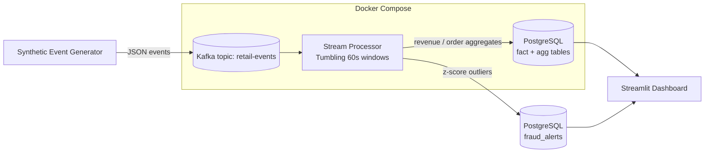

# ⚡ Real-Time Retail Analytics Pipeline

**Streaming data engineering pipeline** that ingests e-commerce clickstream and order events through **Apache Kafka**, performs **windowed stream aggregation** and **statistical anomaly / fraud detection** in-flight, persists curated metrics to **PostgreSQL**, and visualizes live KPIs in a **Streamlit** dashboard — all containerized with **Docker Compose**.

[](../../actions)
[](https://www.python.org/)
[](https://kafka.apache.org/)
[](https://www.postgresql.org/)
[](https://www.docker.com/)
[](LICENSE)

> **Keywords:** real-time data pipeline, Apache Kafka, stream processing, event-driven architecture, ETL, windowed aggregation, anomaly detection, fraud detection, PostgreSQL, Docker, Python data engineering, Streamlit dashboard, tumbling window, z-score outlier detection, data engineer portfolio project.

---

## 🧭 Problem Statement

Retail platforms need **sub-minute visibility** into revenue, order volume, and anomalous transactions instead of waiting on nightly batch ETL. This project simulates a realistic e-commerce event stream and builds a production-style pipeline that turns raw events into **actionable, near-real-time metrics** and **automated fraud alerts**.

## 🏗️ Architecture



**Data flow:**
1. `src/data_generator.py` simulates realistic order/click events (category, price, quantity, country, user, device) with an injected 2% anomalous-transaction rate.
2. `src/producer.py` publishes events to the `retail-events` Kafka topic (JSON, keyed by `user_id` for partition locality).
3. `src/stream_processor.py` consumes the topic, maintains **tumbling 60-second windows** per category, computes revenue/order-count/AOV, and runs a **rolling z-score anomaly detector** on order value to flag likely fraud in-flight.
4. Aggregates and alerts are upserted into PostgreSQL (`sql/schema.sql`).
5. `dashboard/app.py` (Streamlit) polls Postgres for live revenue trends, top categories, and a fraud-alert feed.

## 📂 Repository Structure

```
realtime-retail-analytics-pipeline/
├── src/
│   ├── data_generator.py     # synthetic event generator (Faker-based)
│   ├── producer.py           # Kafka producer
│   ├── stream_processor.py   # Kafka consumer + windowing + anomaly detection
│   ├── aggregation.py        # pure, unit-tested windowing/anomaly logic
│   └── db.py                 # SQLAlchemy models + upsert helpers
├── dashboard/
│   └── app.py                # Streamlit live dashboard
├── sql/
│   └── schema.sql            # Postgres DDL
├── tests/
│   └── test_aggregation.py   # pytest unit tests for core logic
├── docker-compose.yml         # Zookeeper + Kafka + Postgres + services
├── Dockerfile
├── requirements.txt
└── .github/workflows/ci.yml   # lint + unit tests on every push
```

## 🚀 Quickstart

```bash
git clone https://github.com/Satyammedya33/realtime-retail-analytics-pipeline.git
cd realtime-retail-analytics-pipeline

# 1. Spin up Kafka, Zookeeper, Postgres, the producer, and the stream processor
docker compose up --build

# 2. In another terminal, launch the live dashboard
pip install -r requirements.txt
streamlit run dashboard/app.py
```

Postgres is reachable on `localhost:5432` (`retail` / `retail` / db `retail`) and Adminer at `localhost:8080` for ad-hoc SQL.

### Run just the core logic (no Docker/Kafka needed)

```bash
pip install -r requirements.txt
pytest tests/ -v
python -m src.data_generator --events 500 --out sample_events.jsonl
```

## 📊 What It Demonstrates

| Data Engineering Skill | Where |
|---|---|
| Event-driven / streaming architecture | `producer.py`, `stream_processor.py` |
| Tumbling-window stream aggregation | `aggregation.py::TumblingWindowAggregator` |
| Real-time anomaly / fraud detection (rolling z-score) | `aggregation.py::AnomalyDetector` |
| Idempotent upserts / schema design | `sql/schema.sql`, `db.py` |
| Containerized multi-service deployment | `docker-compose.yml` |
| Automated testing & CI | `tests/`, `.github/workflows/ci.yml` |
| BI-style visualization | `dashboard/app.py` |

## 🧪 Testing

```bash
pytest tests/ -v --cov=src
```

Core aggregation and anomaly-detection logic is decoupled from Kafka I/O specifically so it can be unit-tested deterministically without a running broker.

## 🛣️ Roadmap

- [ ] Swap tumbling windows for Kafka Streams / Faust for exactly-once semantics
- [ ] Add Apache Spark Structured Streaming variant for higher throughput
- [ ] Push aggregates to a managed warehouse (Snowflake / BigQuery) via Kafka Connect
- [ ] Add Grafana + Prometheus for pipeline observability

## 📄 License

MIT — see [LICENSE](LICENSE).

---

**Author:** [Satyam Medya](https://www.linkedin.com/in/satyam-medya-2b2825370) · [GitHub](https://github.com/Satyammedya33)
